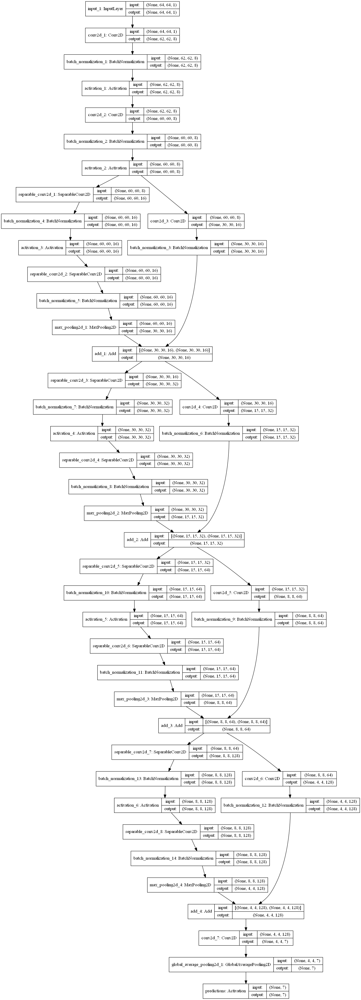
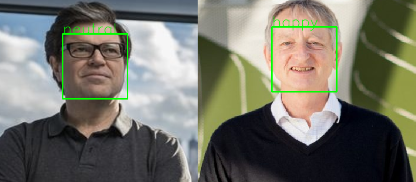

# Emotion classification
real-time face detection and emotion classification
* the test accuracy is 66% in the kaggle competion dataset fer2013
* the test accuracy is 99.87% in the CK+ dataset
* the average emotion classifer model predict cost time is 4~ 10ms in real-time videos captured from webcam
 ##dataset source:
 * CK+:
 > [The Extended Cohn-Kanade (CK+) database distribution](http://www.pitt.edu/~emotion/ck-spread.htm).there are 593 sequences across 123 subjects which are FACS coded at the peak frame
 > ONLY 327 of the 593 sequences have emotion sequences.(emoton labels.{0: 'neutral', 1: 'anger', 2: 'contempt', 3: 'disgust',
             4: 'fear', 5:'happy', 6:'sadness', 7:'surprise'})
 * fer2013:
 
 > the kaggle competitions: Challenges in Representation Learning: Facial Expression Recognition Challenge
 > https://www.kaggle.com/c/challenges-in-representation-learning-facial-expression-recognition-challenge
 > The dataset provided in the competion consists of gray scale images which are 48 x 48 in dimension and the corresponding labels consisting of 7 emotions.
 > (emtion labels.{0:'angry',1:'disgust',2:'fear',3:'happy', 4:'sad',5:'surprise',6:'neutral'})
 ## classification model use mini_XCEPTION
 
 ## Emtion classification examples
 * test image
 
 
 
 * test video
 
 
# Reference

* [Xception: Deep Learning with Depthwise Separable Convolutions](https://arxiv.org/abs/1610.02357)
* [Keras Applications](https://keras.io/applications/)
 
Prerequisites
-------------
* Python 3.5
* OpenCV
* Dlib
* keras
* Numpy
* TensorFlow
